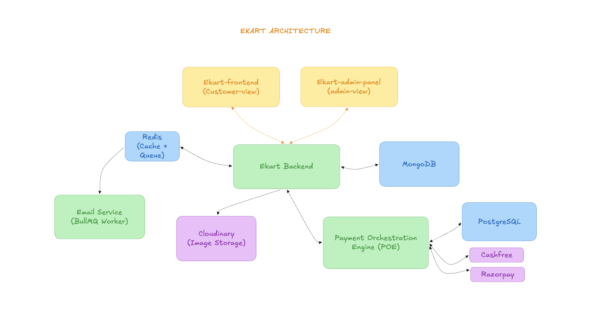

# eKart Backend

REST API backend for the eKart ecommerce platform, responsible for authentication, product management, orders, inventory, and admin operations. The backend integrates with a standalone Payment Orchestration Engine for payment processing and uses Redis with BullMQ for asynchronous background jobs such as email delivery.

---

## Highlights

- Payment Orchestration Engine integration
- Modular domain-driven architecture
- Asynchronous email processing with BullMQ
- Redis-powered caching and rate limiting
- Role-Based Access Control (RBAC)
- MongoDB + Mongoose ODM
- Dockerized deployment

---

## Architecture



The eKart Backend serves as the central application layer, receiving requests from both the customer-facing frontend and the admin dashboard. It persists application data in MongoDB, uses Redis for caching and queue management, stores product images in Cloudinary, and delegates all payment operations to a standalone Payment Orchestration Engine. Background tasks such as email delivery are processed asynchronously by a dedicated BullMQ worker.

---

## Request Flow

### Order & Payment Flow

1. The customer initiates checkout.
2. The backend validates pricing and creates a snapshot-based order.
3. The backend requests the Payment Orchestration Engine to create a payment.
4. The Payment Orchestration Engine communicates with the configured payment gateway (Razorpay or Cashfree).
5. The client completes the payment using the returned payment details.
6. The payment gateway asynchronously sends a webhook event to the Payment Orchestration Engine.
7. The Payment Orchestration Engine verifies the gateway webhook and forwards a success webhook to the eKart backend.
8. The backend verifies the webhook signature, confirms the order, updates inventory, and queues background tasks.

### Background Job Processing

1. Business events (user registration, successful order, etc.) create email jobs.
2. The backend pushes jobs into Redis using BullMQ.
3. The Email Worker processes queued jobs asynchronously.
4. Emails are delivered without blocking API responses.

---

## API Documentation

Interactive API documentation is available through OpenAPI / Swagger.

- **Live:** https://ekart-backend-s0x7.onrender.com/docs
- **Local:** http://localhost:3000/docs

---

## Related Repositories

- [eKart Frontend](https://github.com/sn0914r/ekart-frontend)
- [eKart Admin Panel](https://github.com/sn0914r/ekart-admin-panel)
- [Payment Orchestration Engine](https://github.com/sn0914r/payment-orchestration-engine)
- [Email Worker Service](https://github.com/sn0914r/email-worker-service)

---

## Core Features

### Authentication & Authorization

- JWT authentication with Access and Refresh Tokens
- Secure refresh token rotation using HTTP-only cookies
- Role-Based Access Control (RBAC)

### Product & Inventory Management

- Product CRUD operations
- Filtering, sorting, and pagination
- Inventory management
- Multi-image uploads with Cloudinary

### Orders & Payments

- Snapshot-based order storage
- Integration with the Payment Orchestration Engine
- Transaction-safe order confirmation and inventory updates

### Admin Dashboard

- Revenue analytics
- Order statistics
- Low-stock monitoring

### Infrastructure

- Redis caching
- Redis-backed rate limiting
- BullMQ background jobs
- Joi request validation
- OpenAPI / Swagger documentation
- Docker support

---

## Tech Stack

| Category | Technology |
|----------|------------|
| Runtime | Node.js |
| Framework | Express.js |
| Database | MongoDB |
| ODM | Mongoose |
| Cache & Queue | Redis, BullMQ |
| Validation | Joi |
| Authentication | JWT, bcryptjs |
| File Storage | Cloudinary |
| Documentation | Swagger (OpenAPI) |
| Containerization | Docker |

---

## Folder Structure

```text
.
├── docs/
├── images/
│   └── architecture.png
├── src/
│   ├── clients/
│   ├── configs/
│   ├── constants/
│   ├── errors/
│   ├── middlewares/
│   ├── modules/
│   │   ├── auth/
│   │   ├── cart/
│   │   ├── insights/
│   │   ├── order/
│   │   ├── payment/
│   │   ├── product/
│   │   └── wishlist/
│   ├── providers/
│   ├── queues/
│   └── utils/
├── .dockerignore
├── .env.example
├── .gitignore
├── compose.yml
├── compose.dev.yml
├── compose.prod.yml
├── Dockerfile
├── eslint.config.mjs
├── package.json
└── README.md
```

---

## Environment Variables

```env
PORT=3000
NODE_ENV=development
CLIENT_ORIGINS=http://localhost:5173

CLOUDINARY_API_KEY=
CLOUDINARY_API_SECRET=
CLOUDINARY_CLOUD_NAME=

MONGO_URI=

JWT_ACCESS_TOKEN_SECRET=
JWT_REFRESH_TOKEN_SECRET=
JWT_ACCESS_TOKEN_EXPIRES=
JWT_REFRESH_TOKEN_EXPIRES=

REDIS_URL=

PAYMENT_SERVICE_API_URL=
PAYMENT_SERVICE_SECRET=
```

---

## Run with Docker

The project uses Docker Compose with separate configurations for development and production, alongside a base setup for dependencies (MongoDB and Redis).

### Development Mode

Runs the app with hot-reloading and mounts your local files:

```bash
docker compose -f compose.yml -f compose.dev.yml up --build
```

### Production Mode

Builds and runs the optimized production image:

```bash
docker compose -f compose.yml -f compose.prod.yml up -d --build
```

---

## Local Setup

1. Clone the repository

```bash
git clone https://github.com/sn0914r/ekart-backend.git
```

2. Install dependencies

```bash
npm install
```

3. Configure environment variables

Copy `.env.example` to `.env` and provide the required credentials.

4. Start the development server

```bash
npm run dev
```

---

## API Endpoints

### Authentication

| Method | Endpoint | Description |
|---------|----------|-------------|
| POST | /auth/register | Register a user |
| POST | /auth/login | Login |
| POST | /auth/refresh | Refresh access token |
| POST | /auth/logout | Logout user |

### Products

| Method | Endpoint | Description |
|---------|----------|-------------|
| GET | /products | List all products |
| GET | /products/:id | Get product details |
| GET | /products/colors | Get available colors |

### Cart

| Method | Endpoint | Description |
|---------|----------|-------------|
| GET | /cart | Retrieve user cart |
| POST | /cart/add | Add product to cart |
| PATCH | /cart/increase | Increase item quantity |
| PATCH | /cart/decrease | Decrease item quantity |
| DELETE | /cart/remove/:id | Remove item from cart |
| DELETE | /cart/clear | Clear the entire cart |

### Wishlist

| Method | Endpoint | Description |
|---------|----------|-------------|
| GET | /wishlist | Get user wishlist |
| POST | /wishlist | Add product to wishlist |
| DELETE | /wishlist/:productId | Remove product from wishlist |
| DELETE | /wishlist | Clear wishlist |

### Orders & Payments

| Method | Endpoint | Description |
|---------|----------|-------------|
| POST | /orders | Create an order |
| GET | /orders | Get user orders |
| GET | /orders/:id | Get order details |
| PATCH | /orders/:id | Cancel an order |
| POST | /payments/create | Create a payment |
| POST | /payments/verify | Verify a payment |

### Admin Operations

| Method | Endpoint | Description |
|---------|----------|-------------|
| GET | /admin/dashboard | Dashboard metrics |
| GET | /admin/analytics | Revenue analytics |
| GET | /admin/products | List all products (Admin) |
| GET | /admin/products/:id | Get product details (Admin) |
| POST | /admin/products | Create a product |
| PATCH | /admin/products/:id | Update a product |
| DELETE | /admin/products/:id | Delete a product |
| GET | /admin/orders | List all orders (Admin) |
| GET | /admin/orders/:id | Get order details (Admin) |
| PATCH | /admin/orders/:id | Update order status |

---

## Security

- JWT authentication for protected routes
- Role-Based Access Control (RBAC)
- Server-side pricing validation
- Secure integration with the Payment Orchestration Engine
- Joi request validation
- Redis-backed API rate limiting
- Centralized error handling